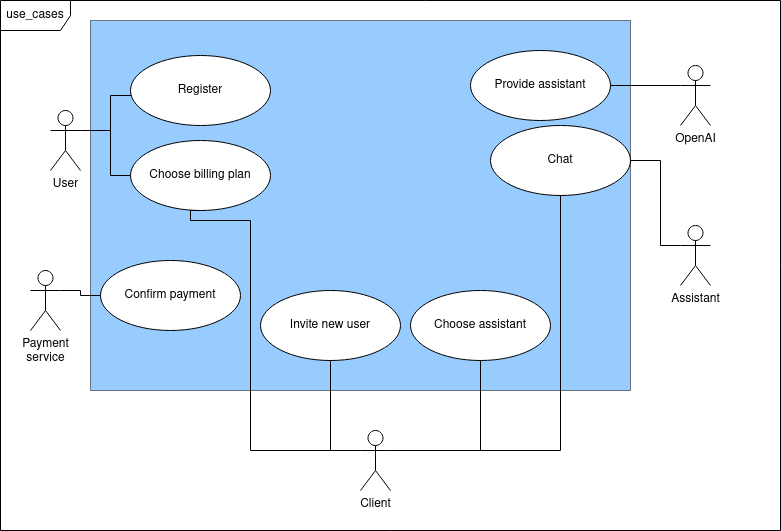

# Business Requirements

We provide a user-friendly UI to an AI-aided assistance

# Actors

* OpenAI
  * The source of assistants
* Payment service
  * External service to process payment
* Assistant
  * Provided assistant by OpenAI
* Client
  * User, who purchased a billing plan
* Visitor
  * Any user visiting the site

# Use Cases

* OpenAI
  * Provide an assistant
* Payment service
  * Process payment
  * Confirm payment
* Assistant
  * Write a response based on a request
* Client
  * Choose an assistant
  * Write to an assistant
  * Invite new user to get a discount
  * Change a billing plan
* Visitor
  * Register
  * Choose a billing plan

The diagram of use cases can be viewed below:

